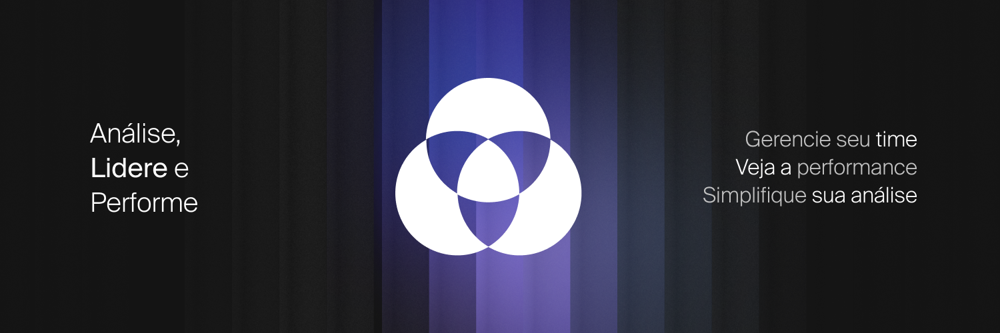
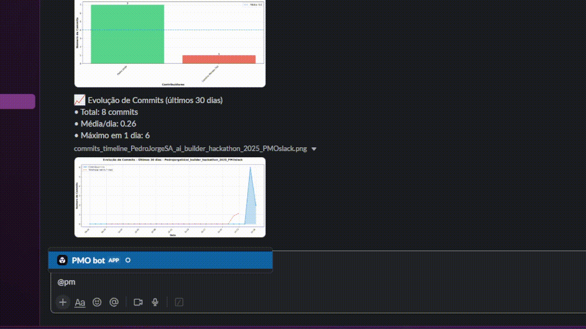
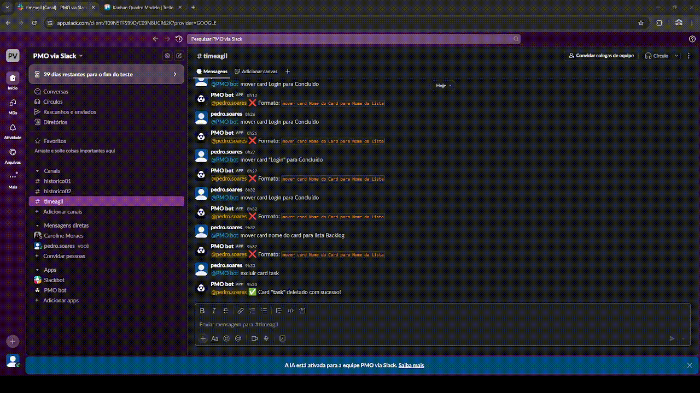
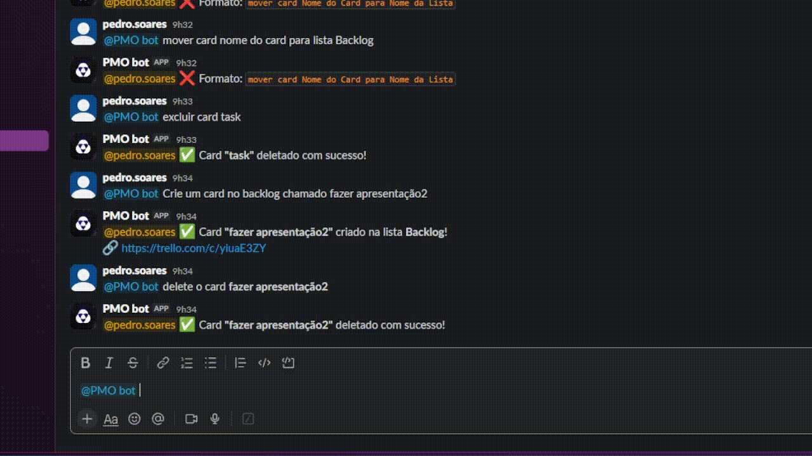
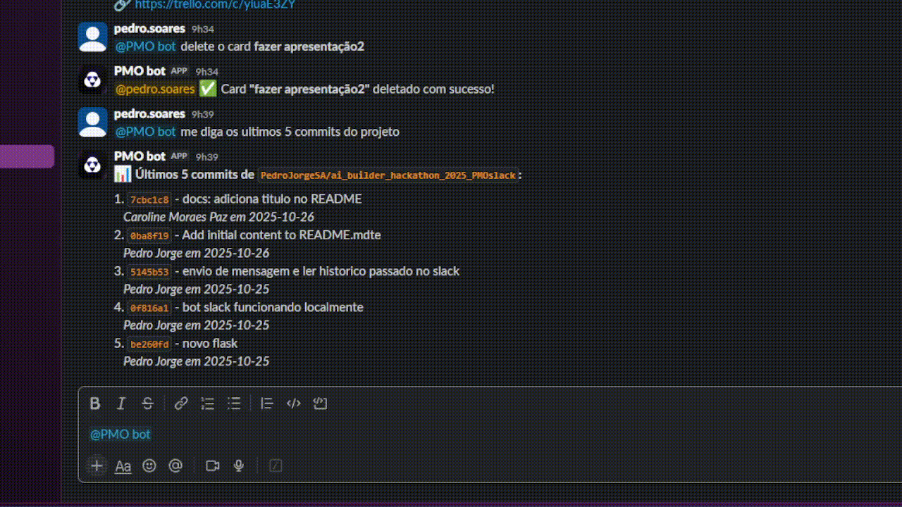

# Synco
PMO Inteligente: o *"ChatGPT dos Projetos"* que conecta Slack, Trello e GitHub com automação, insights e gráficos em tempo real.
___

  

## 💡 Sobre o Synco

**Synco** é um assistente inteligente que revoluciona o gerenciamento de projetos através de **conversação natural** no Slack. Simplesmente mencione o bot e peça o que precisa - ele entende, processa e executa. Sem cliques, sem abas, sem complicação.

**O diferencial?** Análise de dados em tempo real com gráficos gerados por IA, busca inteligente por similaridade e integração nativa com suas ferramentas de trabalho. Tudo isso respondendo em segundos diretamente no seu chat.

---

### 🧪 Teste Agora
**[Entrar no Slack →](https://join.slack.com/t/pmoviaslack/shared_invite/zt-3gn1uow6u-F~WNLomzS9TjThWF6~wIPw)** Teste a Synco em ação

### 📦 Repositórios
- **[GitHub](https://github.com/PedroJorgeSA/ai_builder_hackathon_2025_PMOslack)** - Código-fonte do projeto
- **[Trello Board](https://trello.com/b/ddJDEAXb/kanban-quadro-modelo)** - Quadro Kanban de exemplo

### 🎥 Apresentação do Projeto
- **[📊 Slides de Apresentação](https://www.figma.com/deck/Fp7r5j6uwulPvhXdMMY94H/Slide-Synco?node-id=1-401&p=f&viewport=-1803%2C46%2C0.13&t=na0TOok0UtJKzi80-1&scaling=min-zoom&content-scaling=fixed&page-id=0%3A1)** - Apresentação completa no Figma
- **[🎬 Vídeo Demo](https://youtu.be/HZYC8Y5OFPo)** - Demonstração prática do Synco em ação

---

## 🚀 O que você pode fazer no Slack

### 💬 Interface Conversacional
_Converse naturalmente com a Synco no Slack. Mencione o bot e peça o que precisa - ele entende linguagem natural, interpreta suas intenções e executa as ações automaticamente. Simples, rápido e intuitivo._

- `@PMO bot ajuda` _(mostra todos os comandos disponíveis)_
- `@PMO bot listar cards` _(visualize seus cards do Trello)_
- `@PMO bot estatística de commits` _(gráficos e análises instantâneas)_
- `@PMO bot resumo de atividades` _(overview do projeto)_

  

### 📋 Trello Integration
_Gerencie seu board do Trello sem sair do Slack. Crie, mova e organize cards usando linguagem natural, sem precisar lembrar IDs ou abrir o navegador. O bot entende variações de comandos e extrai automaticamente nomes de cards e listas._

- `@PMO bot criar card Implementar nova funcionalidade`
- `@PMO bot listar cards`
- `@PMO bot mostrar cards`
- `@PMO bot listar listas`
- `@PMO bot mover card Login para Concluído`
- `@PMO bot deletar card Tarefa antiga`

  

### 🐙 GitHub Integration
_Acompanhe o desenvolvimento do projeto com análises visuais instantâneas. O bot processa commits, identifica contribuidores e calcula médias diretamente no chat. Perfeito para stand-ups e retrospectivas._

- `@PMO bot me diga os últimos 5 commits`
- `@PMO bot mostrar últimos 10 commits`

  

### 📊 Estatísticas
_Gere gráficos profissionais (barras, linhas, pizza) com análises de produtividade e tendências em segundos._

- `@PMO bot estatística de commits` _(ranking de contribuidores + evolução temporal)_
- `@PMO bot estatística do trello` _(distribuição de cards por lista)_
- `@PMO bot resumo de atividades` _(análise dos últimos 7 dias)_

  

